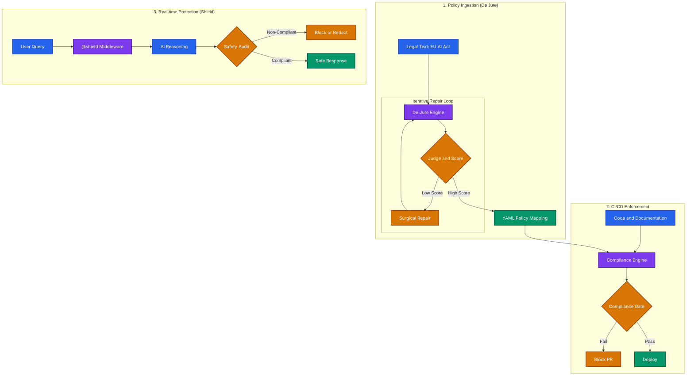

<div align="center">

# RaiFlow
### RAI Policy-to-Code Compliance Framework

[](https://github.com/Agicademia/RaiFlow)
[](https://opensource.org/licenses/MIT)
[](https://www.python.org/)
[](https://eur-lex.europa.eu/eli/reg/2024/1689/oj)

A technical framework designed to translate dense Responsible AI (RAI) policy documents into strict, testable Python assertions and automated CI/CD pipelines.

</div>

---

RaiFlow provides a bridge between governance requirements and engineering enforcement for AI systems, with a focus on regulatory compliance automation.

## Architecture and Process Flow



## Key Features

### EU AI Act Compliance
- Comprehensive Article Coverage: Mapped Articles 9-14 of the EU AI Act (Regulation (EU) 2024/1689)
  - Article 9: Risk Management System
  - Article 10: Data and Data Governance
  - Article 11: Technical Documentation
  - Article 12: Record-Keeping and Logging
  - Article 13: Transparency and Information Provision
  - Article 14: Human Oversight
- 27 Specialized Evaluators: LLM-powered compliance checks for each regulatory requirement.
- De Jure Pipeline: Iterative LLM self-refinement for accurate policy interpretation.
- Shield Middleware: Decorator-based compliance enforcement for AI pipelines.
- HTTP Interceptor: Transparent proxy for auditing any RAG API without code changes.

### Core Capabilities
- Policy Mapping: YAML-based schema linking governance IDs to technical evaluators.
- Project Analyzer: Automated scanning of projects for AI components and regulatory risk mapping.
- LLM-as-a-Judge: Advanced semantic evaluation using local or cloud-based LLMs.
- Audit Trail: Standardized JSON logging for regulatory traceability.

## Project Structure

```
.
├── raiflow/                 # Core Framework Package
│   ├── evaluators/          # Compliance check implementations (27+ checks)
│   ├── engine.py           # De Jure iterative repair engines
│   ├── shield.py           # Native Python middleware decorator
│   ├── interceptor.py      # HTTP proxy for zero-code auditing
│   ├── analyzer.py         # Static project risk scanner
│   ├── reporter.py         # Compliance report generators
│   └── dashboard/          # Control Plane UI assets
├── policies/                # Regulatory Framework Library
│   ├── eu_ai_act.yaml      # Mapped EU AI Act rules
│   └── nist_ai_rmf.yaml    # Mapped NIST AI RMF rules
├── examples/                # Integration Demonstrations
│   ├── shield_demo.py      # Decorator usage example
│   └── dejure_demo.py      # Iterative pipeline example
├── tests/                   # Automated Compliance Test Suite
│   └── eu_ai_act_test.py   # Comprehensive validation suite
├── server.py               # Dashboard API entry point
└── requirements.txt         # Project dependencies
```

## Installation

### Prerequisites
- Python 3.8 or higher.
- Optional: Ollama (for offline LLM evaluation).
- Optional: Google Gemini API key (for cloud evaluation).

### Quick Start

1. Clone the repository:
   ```bash
   git clone https://github.com/Agicademia/RaiFlow.git
   cd RaiFlow
   ```

2. Install dependencies:
   ```bash
   pip install -r requirements.txt
   ```

3. Set up the LLM Backend:

   Option A: Local with Ollama
   ```bash
   # Download Ollama and pull the model
   ollama pull gemma2:2b
   ```

   Option B: Cloud with Google Gemini
   ```bash
   export GEMMA_API_KEY="your-api-key-here"
   ```

## Usage

### 1. Control Plane Dashboard
Launch the dashboard to monitor audits in real-time:
```bash
python server.py
```
Open http://localhost:8000 in your browser.

### 2. HTTP Interceptor
Audit any RAG API transparently:
```bash
python -m raiflow.interceptor --target http://localhost:7860 --port 8080
```

### 3. Shield Middleware
Apply guardrails to your functions:
```python
from raiflow import shield

@shield(framework="eu_ai_act")
def my_ai_function(query: str):
    return {"answer": "...", "context": "..."}
```

## Configuration

Environment Variables:
- `GEMMA_API_KEY`: Required for Gemini-based evaluation.
- `RAI_MODEL`: Specify the model (default: `gemma2:2b`).
- `RAI_THRESHOLD`: Set the compliance pass threshold (default: `0.7`).

## Future Enhancements
We are moving towards:
- LLM-as-a-Judge: Integrating ragas and deepeval for semantic evaluations.
- Regulation Expansion: Mapping the EU AI Act and ISO 42001.
- Real-time Guardrails: FastAPI/LangChain middleware for active protection.

For more details, see enhancements_ideas.md.

## Contributing
We welcome contributions. Please see CONTRIBUTIONS.md for guidelines.

## License
MIT License - see LICENSE file for details.

---
Disclaimer: RaiFlow is a compliance assistance tool and does not constitute legal advice. Always consult with legal counsel for regulatory compliance matters.
